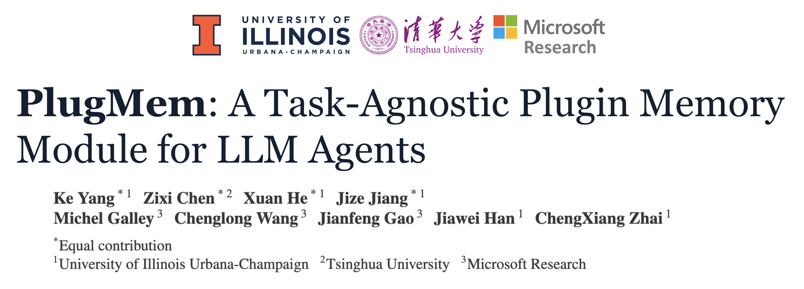
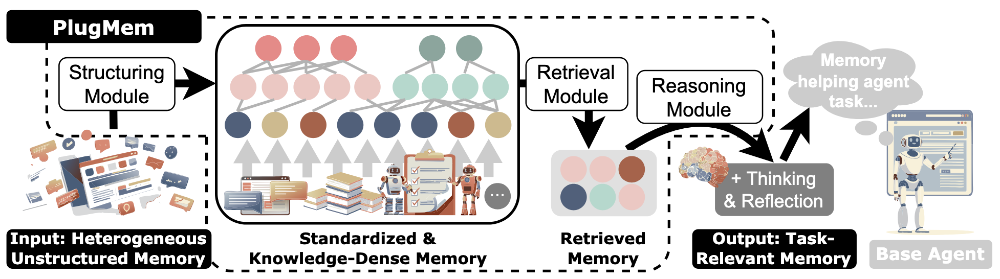
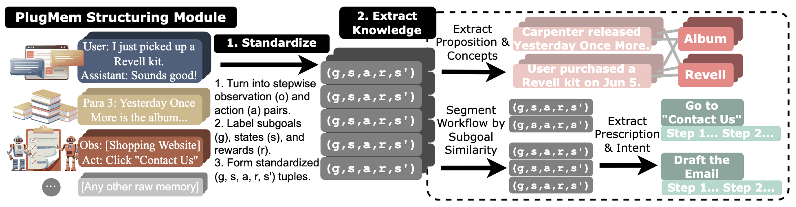

# PlugMem


**PlugMem** is a **plug-and-play long-term memory system for LLM agents**. Instead of storing and retrieving raw interaction histories, PlugMem organizes experience into **compact, reusable knowledge units**, allowing agents to recall what matters with minimal context overhead.

The module is **task-agnostic by design** and can be integrated into existing agent pipelines with minimal effort, serving as a general memory backbone for diverse environments such as dialogue agents, knowledge-intensive QA, and web automation. 

For more details, please see the full paper: [https://arxiv.org/abs/2603.03296](https://arxiv.org/abs/2603.03296)



## Features
### Memory
- **Three Memory Types**: 
  - **Semantic** (facts, concepts): User preferences, factual information
  - **Procedural** (workflows, procedures): How-to knowledge, step-by-step processes
  - **Episodic** (interaction sequences): Long interaction sessions stored on disk, referenced by ID
- **Graph Structure**: Maintain hierarchical knowledge units to illustrate the relationship between memories.
- **LLM Enhancement**: Use LLMs for intelligent knowledge extraction, memory retrieval, and reasoning
- **Memory Compression and Evolution**: Naively support updating and evolving the memory graph.



### Plug-in
- **Enhance your agent with 6 lines of code**
```python
# init PlugMem memory graph
mg = MemoryGraph()
# init memory sequence
mem = Memory(...)
mem.append(...)
mem.close()
# insert memory sequence into memory graph
mg.insert(mem)
# retrieve memory and perform reasoning on retrieved nodes
mg.retrieve_and_reason(...)
```
- **Easy to modify**: Apply adaptive strategies by defining different value functions and reasoning prompts.

### Coding-agent integration
PlugMem ships a Claude Code plugin that turns the service into a
**self-writing CLAUDE.md** — the agent learns project conventions,
debugging recipes, and personal preferences from your sessions and
recalls them at the start of future sessions.

- **Plugin:** [`plugmem-coding-claude-code/`](./plugmem-coding-claude-code/) — install with `claude --plugin-dir <path>`.
- **Onboarding:** [ONBOARDING.md](./plugmem-coding-claude-code/ONBOARDING.md) walks from zero to a verified loop in ~15 min.
- **Architecture:** [`design_docs/plugmem_for_coding.md`](./design_docs/plugmem_for_coding.md) for the cross-session-memory design, promotion gate, recall policy, and per-harness graph isolation.

OpenCode and OpenClaw adapters are planned (see the design doc); only the Claude Code adapter ships today.

## Installation
1. Install benchmarks in `src/` and follow their installation docs to set up the environment.
2. Install/upgrade `openai==2.6.1`.
3. Additional modifications:
- **WebArena**
```bash
# under src/
cd src
# clone modified AgentOccam
git clone https://github.com/jizej/AgentOccam
# clone 
git clone https://github.com/web-arena-x/webarena
# Enable Scriptbrowserenv to run under async loop (if needed)
cp src/webarena_patch/envs.py src/webarena/browser_env/envs.py
# Enable OPENAI_API_KEY + AZURE_ENDPOINT for trajectory evaluation (if needed)
cp src/webarena_patch/openai_utils.py src/webarena/llms/providers/openai_utils.py
```

## Quick Start
1. Export Parameters
```bash
export OPENAI_API_KEY=<your_openai_api_key>
export AZURE_ENDPOINT=<your_azure_endpoint>
export DIR_PATH="/<your_path_to_PlugMem>/data"
export QWEN_BASE_URL="http://<your_qwen_host>:8000/v1"
export EMBEDDING_BASE_URL="http://<your_embedding_host>:8001/v1/embeddings"
```
2. Host local inference servers (Qwen + Embedding)
```bash
cd host_local_inference
# Qwen (vLLM) server
bash vllm_deploy.sh
# NV-Embed-v2 server
bash nv_embed_v2_deploy.sh
```
3. Make needed directory
```bash
mkdir -p "$DIR_PATH/episodic_memory" \
         "$DIR_PATH/semantic_memory" \
         "$DIR_PATH/procedural_memory" \
         "$DIR_PATH/tag" \
         "$DIR_PATH/subgoal"
```
4. Run examples for different benchmarks
   ### WebArena
   ```bash
   cd src/eval/webarena
   python eval_agentoccam.py
   ```
   Options for `eval_agentoccam.py`:
   - `--config`: Path to the YAML config file (required).
   - `--replay-trajectory/--no-replay-trajectory`: Replay a saved trajectory before evaluation.
   - `--trajectory-dir`: Directory containing trajectory JSON files for replay.
   - `--load_memory_graph/--no-load_memory_graph`: Load a persisted memory graph from disk.
   - `--refresh-embeddings/--no-refresh-embeddings`: Refresh embeddings when loading the memory graph.
   - `--read-only-memory/--no-read-only-memory`: Use the memory graph without inserting new memories.
   - `--disable-memory-graph/--no-disable-memory-graph`: Turn off all memory-graph operations.
   ### LongMemEval
   ```bash
   cd src/eval/longmemeval
   python eval_longmemeval_all.py
   ```
   ### HotpotQA(HippoRAG 2)
   ```bash
   cd src/eval/hotpotqa
   # It may take several hours to structure memory for hotpotqa_corpus.json.
   python build.py
   #Rebuild the memory graph from structuring result and run test
   python eval_hotpotqa_all.py
   ```

## Reproducibility
- We release agent trajectories and memory graph artifacts for all three tasks.
- We release human demonstrations used for WebArena (Under License CC BY 4.0).
- Data available in Google Drive: https://drive.google.com/drive/folders/15feC6xYsONJhJAb2n1kPjGrjSt0weHXi?usp=sharing

## Citation
If you use our code or data, or otherwise found our work helpful, please cite our paper:

```
@misc{yang2026plugmemtaskagnosticpluginmemory,
      title={PlugMem: A Task-Agnostic Plugin Memory Module for LLM Agents}, 
      author={Ke Yang and Zixi Chen and Xuan He and Jize Jiang and Michel Galley and Chenglong Wang and Jianfeng Gao and Jiawei Han and ChengXiang Zhai},
      year={2026},
      eprint={2603.03296},
      archivePrefix={arXiv},
      primaryClass={cs.CL},
      url={https://arxiv.org/abs/2603.03296}, 
}
```
